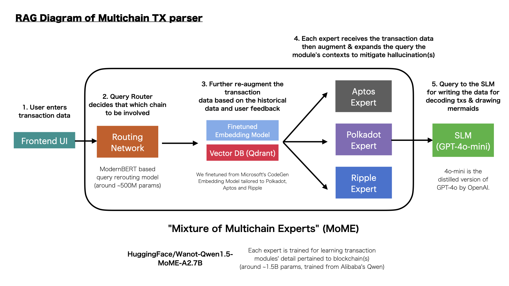
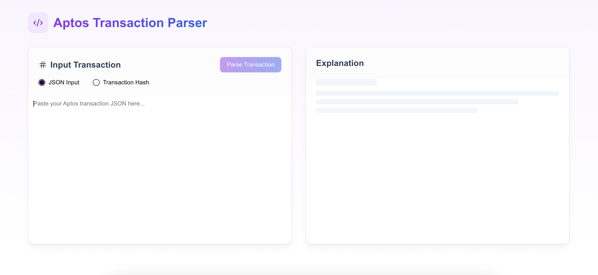
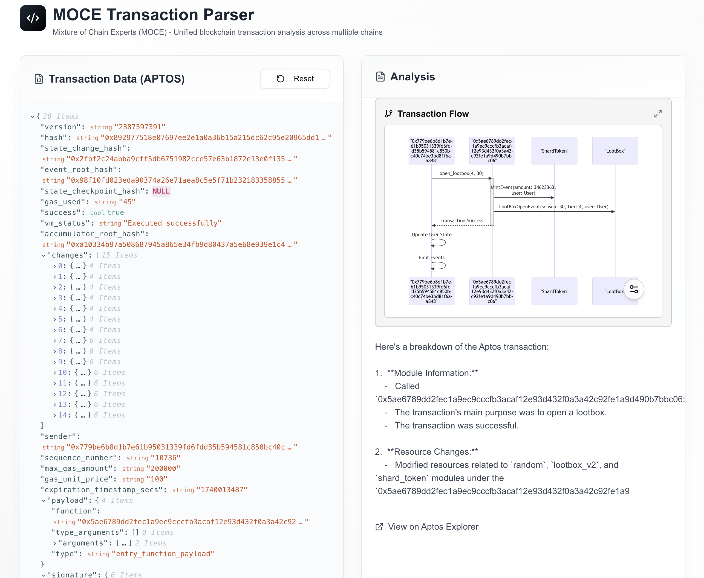
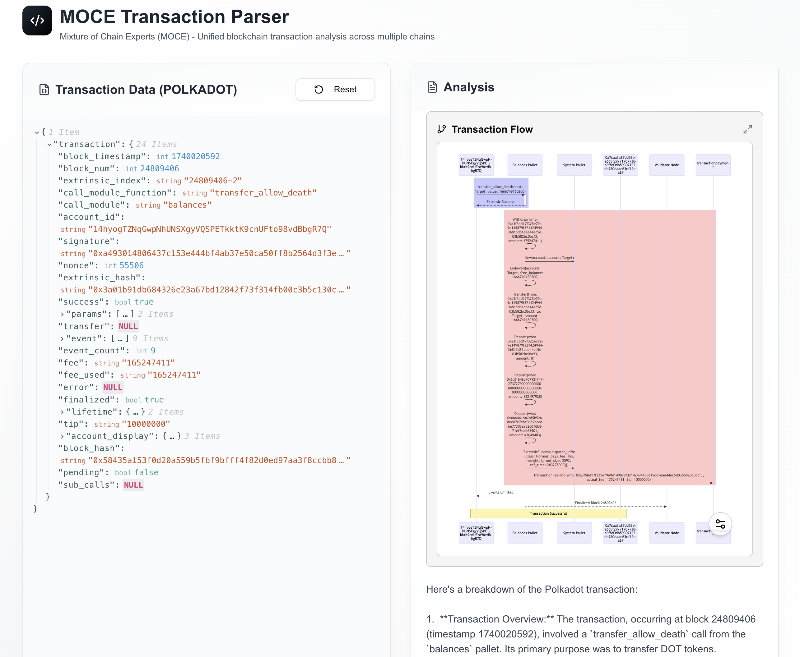
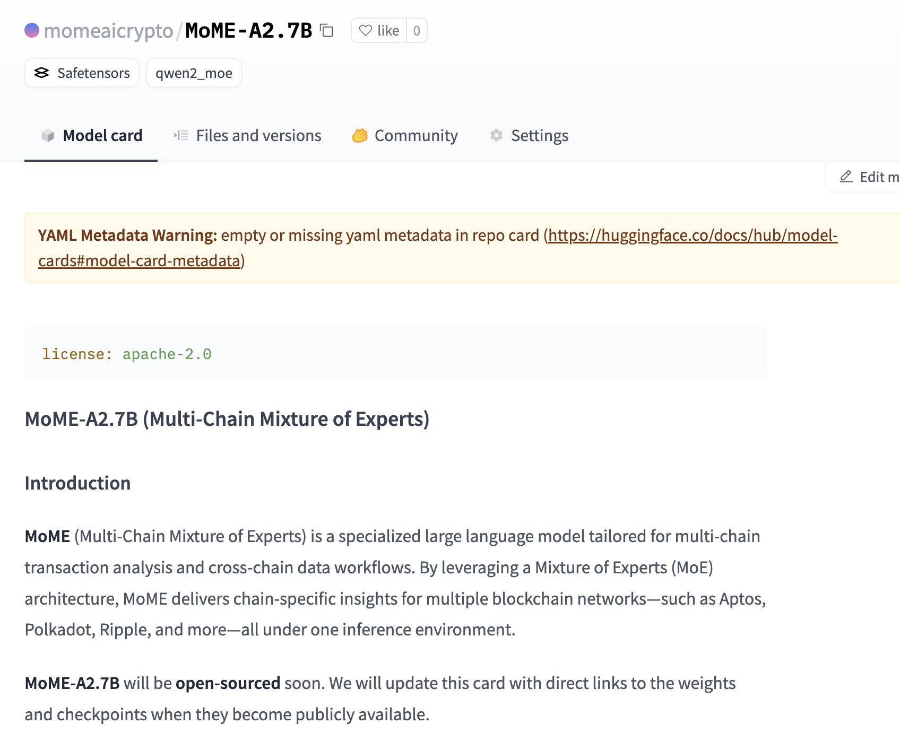
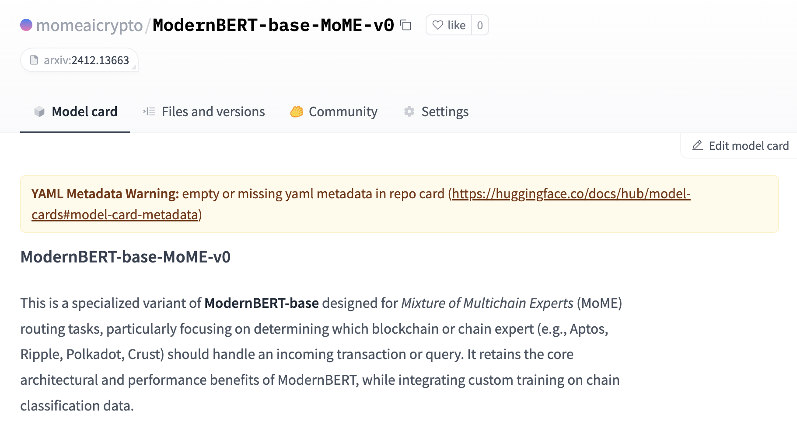
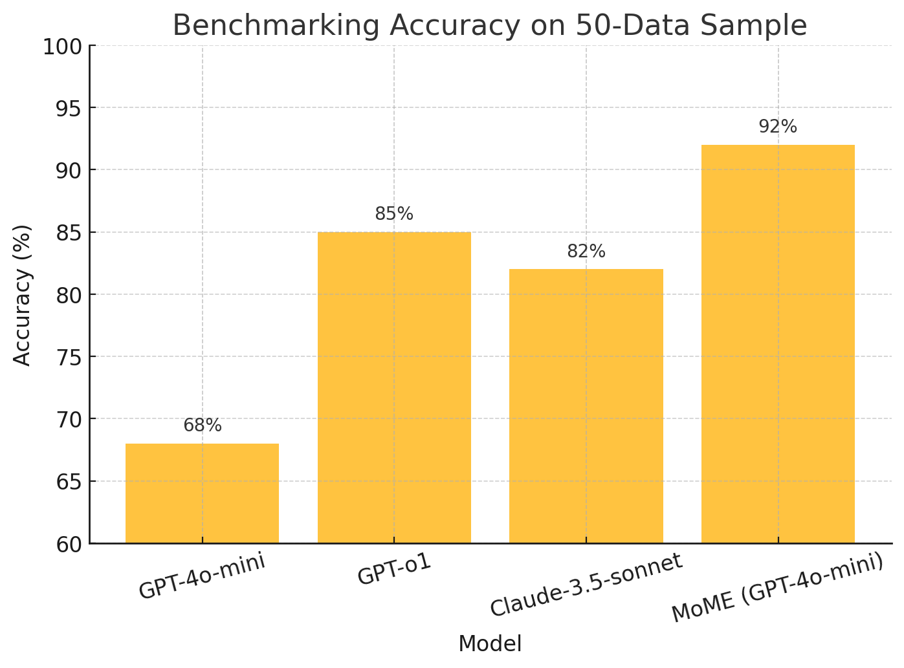

# Multi-Chain Transaction Analyzer: Mixture of Multichain Experts (MoME)

## Short Summary
YouTube: https://www.youtube.com/embed/xEISgC4vJJQ

URL: https://multichain-tx-parser.vercel.app

MoME is an AI-powered platform that automatically parses, verifies, and explains blockchain transactions across multiple networks—Aptos, Ripple, Polkadot, and OriginTrail. By providing clear, human-readable transaction summaries and visual diagrams, our solution ensures transparency and trust, preventing fraud and enabling experts and users alike to verify on-chain data with confidence.

## Full Description



### Problem & Motivation
Blockchain transactions are the lifeblood of decentralized systems. However, due to the diverse formats and proprietary structures of each blockchain, it is challenging to clearly verify and understand transaction details. Without clear, verifiable transaction data, even SOTA (state-of-the-art) LLM models like DeepSeek R1 or GPT-o1 may struggle to accurately detect fraudulent activity or potential scams, leaving users vulnerable to deception. Our platform addresses this critical need by ensuring that every transaction is parsed and presented transparently, fostering trust and accountability in the blockchain ecosystem. We would like to solve this problem by augmenting the contexts around the transaction modules.

### What Is Mixture of Experts (MoE) in LLM?
- Mixture of Experts (MoE) is a neural network architecture that consists of multiple expert networks (or experts), each specializing in a particular type of input or task.
- A gating network (or router) determines which expert(s) should be activated for a given input, effectively splitting the workload among the different experts. When an input arrives, the router scores each expert and applies a weighted combination of the experts’ outputs (often only one or a few experts are chosen).
- The GPT-4 series is widely believed to include MoE techniques to balance performance and efficiency. Even Anthropic explored sparse gating and MoE-like techniques to manage extremely large parameter counts without incurring prohibitive computational costs when serving Claude 3.5 sonnet models via API.

### The MoME Solution
MoME employs a multi-step process to deliver a unified, cross-chain transaction analyzer:
- **Intelligent Routing & Classification:** Using state-of-the-art embedding models and a vector database (Qdrant), MoME automatically classifies the blockchain of a given transaction (Aptos, Ripple, Polkadot, or OriginTrail) and retrieves relevant contextual documents.
- **Chain-Specific Analysis:** Specialized models and prompts process raw transaction data from each network, generating a clear, plain-English summary along with a visual Mermaid diagram to illustrate the transaction flow.
- **Seamless Integration:** Leveraging the Aptos SDK, Merkle Trade SDK, and other chain-specific tools, our platform not only decodes transactions but also supports autonomous trading operations and on-chain verification.
- **Decentralized Transparency:** By ensuring that every transaction can be transparently verified on-chain, MoME helps prevent fraud and builds user confidence in blockchain interactions.

### Technical Architecture

1. **Routing & Classification**
   - **ModernBERT & HF Inference:** Analyze raw transaction data to determine the appropriate blockchain (Aptos, Ripple, Polkadot, or OriginTrail) using advanced embedding models.
   - **Qdrant Integration:** Retrieve historical transaction context and documentation to enrich analysis and mitigate hallucinations.

2. **Chain-Specific Transaction Parsing**
   - **Aptos:** Utilize the Aptos SDK to read and verify Move-based transactions. Integration with the Merkle Trade SDK enables the creation of autonomous trading agents.
   - **Ripple:** Decode and analyze transactions on the XRP Ledger to ensure accurate verification.
   - **Polkadot:** Decode extrinsics and visualize liquidity pools on Polkadot’s AssetHub, supporting advanced DeFi analytics.
   - **OriginTrail:** Although not the primary focus, our solution supports the OriginTrail track—leveraging the decentralized knowledge graph to ensure data integrity and enable cross-chain asset management.

3. **LLM-Powered Summarization**
   - **OpenAI small LLM (mini-sized 4o-mini) :** Generate concise, human-readable explanations of transactions and produce accompanying Mermaid diagrams for visualization, without heavily using reasoning model like o1.

4. **Transparency & Verification**
   - By ensuring that every transaction is clearly presented and verifiable on-chain, MoME empowers users to confidently detect anomalies and fraudulent behavior.

### Eligibility & Track Application

Our project is eligible and uniquely positioned to compete in **all four tracks**:

1. **Aptos:**  
   - **Why:** We use the Aptos SDK for robust transaction parsing and integrate the Merkle Trade SDK to enable autonomous trading operations on Aptos.  
   - **Impact:** Enhances on-chain transparency and provides a verifiable method to read and execute transactions, ensuring user trust.

2. **Ripple:**  
   - **Why:** Our solution extends to the XRP Ledger, offering specialized decoding and verification that highlights clear, accessible transaction summaries.  
   - **Impact:** Facilitates trust by making Ripple transactions transparent and easily verifiable, reducing the risk of fraud.

3. **Polkadot:**  
   - **Why:** We provide visualization for liquidity pools on Polkadot’s AssetHub and decode complex extrinsics to offer comprehensive insights into DeFi operations.  
   - **Impact:** Enables better understanding of decentralized liquidity dynamics and empowers users to monitor asset flows across the Polkadot ecosystem.

4. **OriginTrail:**  
   - **Why:** Although our primary focus is on transaction verification, our platform supports integration with the OriginTrail ecosystem to store, query, and manage decentralized knowledge assets.  
   - **Impact:** Ensures that all on-chain data remains verifiable and transparent, fostering an environment of trust and data integrity within decentralized networks.

5. **Crust Network**:
    - **Why:** We leverage Crust’s decentralized storage capabilities to store transaction data, user feedback, and generated analytics (like mermaid diagrams or historical references) in a tamper-proof and censorship-resistant manner.
    - **Impact:** Provides an immutable and reliable repository for all data, bridging both Web2 and Web3 infrastructures. This ensures users can verify data provenance while benefiting from decentralized storage for long-term archival, security, and trust.

### Roadmap

- **Completed:**
  - Developed a query router that can handle input to determine which blockchain(s) need to be involved.
  - Developed expert model and expands the transaction context to prevent hallucinations.
  - Developed the system re-augments the transaction data based on historical data and user feedback.
  - Developed the system queries the SLM that decode the transaction data and generate human-readable explanations.
  - Finetuned ModernBERT to route the query to the appropriate blockchain expert based on the input.

- **Upcoming:**
  - Expand the expert models by training them on additional blockchain networks.
  - Open-source the benchmark data of multichain transaction parsing accuracy.
  - Refine the model further based on a broader dataset, continuously improving the routing of broader chains.
  - Expand the mermaid output capabilities to generate more detailed visual representations across multiple chains.
  - Improve the scalability to handle larger transaction volumes faster, including the optimization of vector databases and expert model training processes.

### Demo & Repository

**Demo Video:**  
* YouTube: [https://youtu.be/xEISgC4vJJQ](https://www.youtube.com/embed/xEISgC4vJJQ)

**Screenshots:**
#### Front-end interface where users input transaction data for analysis.


#### The example interface for [Merkle Trade (Aptos SDK)](https://aptoscan.com/transaction/2386736279)


#### The example interface for [Polkadot](https://polkadot.subscan.io/extrinsic/0x3a01b91db684326e23a67bd12842f73f314fb00c3b5c130c70ba63ebfffc8059)


**GitHub Repository:**  
[MultiChain Transaction Analyzer Repo](https://github.com/wanotaieng/multichain-tx-parser)

```bash
git clone https://github.com/wanotaieng/multichain-tx-parser.git
cd mome-multichain-parser
npm install
npm run dev
```

**Hugging Face (Model will be open-sourced)**
* [momeaicrypto/MoME-A2.7B](https://huggingface.co/momeaicrypto/MoME-A2.7B)



* [momeaicrypto/ModernBERT-base-MoME-v0](https://huggingface.co/momeaicrypto/ModernBERT-base-MoME-v0)



## Benchmark
We conducted an initial benchmark using 50 test datasets and observed a significant improvement in accuracy. MoME, powered by GPT-4o-mini, outperforms SOTA models like GPT-o1 and Claude-3.5-sonnet. Although GPT-4o-mini alone has lower accuracy, our approach enhances its performance by integrating transaction context and specialized processing.



### Eligibility & Why We Are Eligible

Our solution directly addresses the core issue: **blockchain transactions must be transparent and verifiable to prevent fraud and scams.** Without clear transaction data, users and experts alike may fall victim to deceptive practices. MoME’s AI-powered analysis makes transactions understandable at a glance, ensuring that every on-chain operation is both trustworthy and auditable.

- **Aptos:** By leveraging the Aptos SDK and Merkle Trade SDK, our platform guarantees robust, real-time transaction verification and automated trading capabilities.
- **Ripple:** Our clear parsing of XRPL transactions empowers users to easily verify and trust Ripple network operations.
- **Polkadot:** Our visualization of liquidity pools on AssetHub enables transparent monitoring of decentralized finance activities.
- **OriginTrail:** Our system integrates seamlessly with the OriginTrail ecosystem, ensuring decentralized storage and retrieval of transaction analyses for additional verifiability.

### Future Potential

- **Expand Cross-Chain Coverage:** Incorporate additional blockchains like Ethereum, Solana, or Cosmos.
- **Advanced Trading Agents:** Further develop autonomous trading agents using the Merkle Trade SDK.
- **Enhanced Visualization:** Create detailed, interactive dashboards for tracking liquidity and transaction flows.
- **Community Integration:** Foster a collaborative ecosystem where user feedback continuously refines transaction analysis and blockchain verification.

### License & Contributions

This project is licensed under the **MIT License**. We welcome contributions from the community. Please submit pull requests or open issues on GitHub. For questions or discussions, join our hackathon Discord/Telegram channels.
